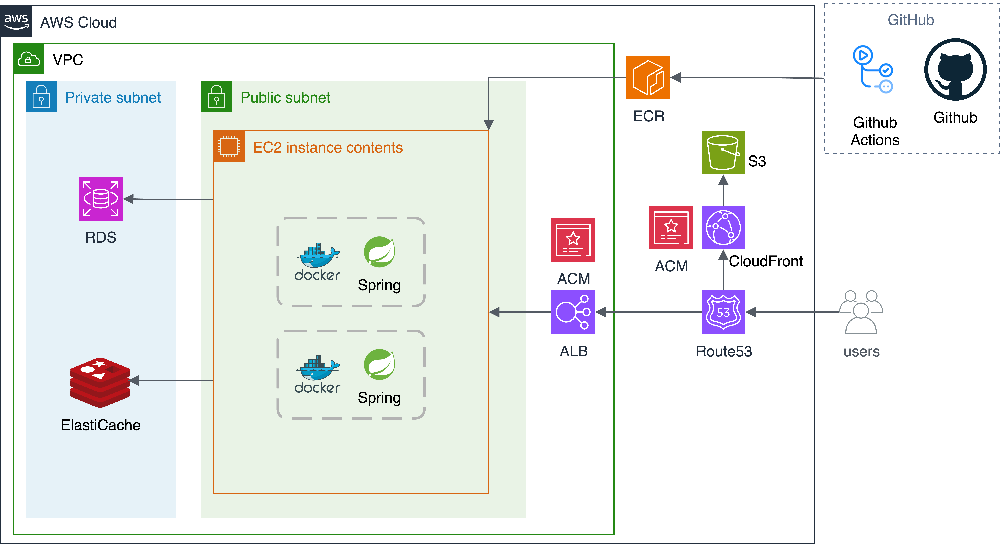

# Roufit
> 지속적인 운동을 위한 느슨한 계획 & 성공적인 운동을 위한 증량 자동화 

### Introduction
- **문제**
  1. 시작할 때 세운 운동 계획을 실천하다 보면 지속적으로 지키기 어려움
  2. 성장을 위해선 어제 보다 오늘 1개 많이, 10초 오래 하는 등의 과부하가 필요하지만 지키기 어려움
  
 

- **해결책**
  1. 느슨한 운동 계획 : 후순위인 운동은 삶이 바쁠 때를 고려한 유동적인 계획이 있어야 합니다.(bad : 매일 운동 / good : 3일에 1번 운동)
  2. 자동 증량 : 운동을 끝내고 성공 여부 피드백을 받고 운동 템플릿 세팅에 따른 자동 증량

### 정보
- 배포 주소 : https://www.roufit.site
- Swagger : https://api.roufit.site/swagger-ui.html
- 개발자 : 은종혁 - ejh990521@gmail.com

### 개발 진행도
Back-end  : 70%  
Front-end : 30%  
Deploy    : complete

### UI

### Architecture & Stack
**Architecture**

**Stack**
- Backend : Java, Spring
- Frontend : React, Zustand
- DB  : MySQL
- Infra : AWS, Docker

### ERD
